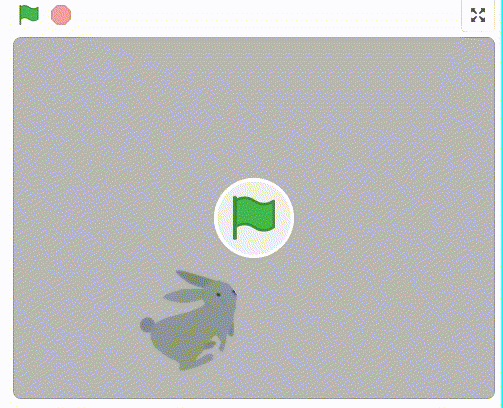
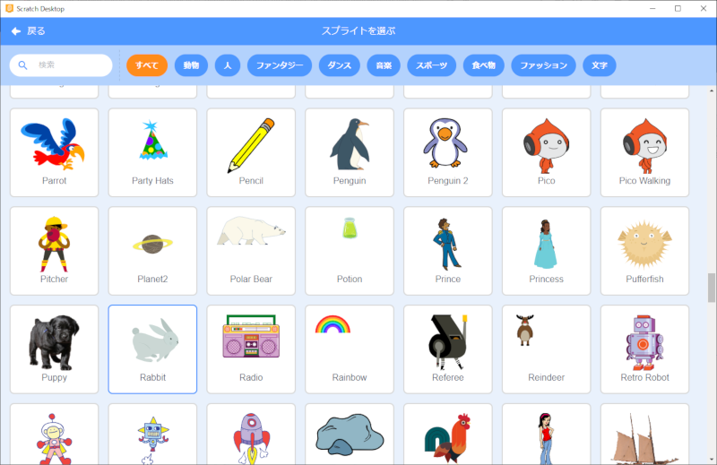
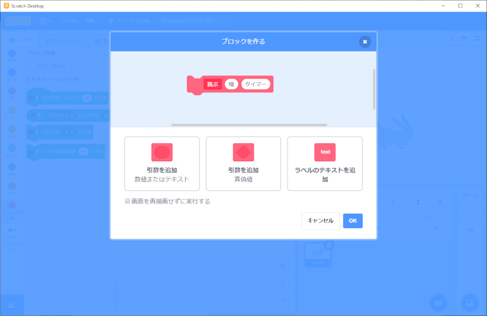
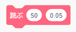

# 1.はじめに

このドキュメントでは、Scratch 3.0でビデオモーションセンサーを使った『ウサギが走り回る』アニメーションの作成方法を説明します。

This document explains how to create a "rabbit running around" animation using video motion sensors in Scratch 3.0.

ドキュメント作成者：望月 綾子(NTTテクノクロスサービス株式会社)、神長 貴博(NTTテクノクロス株式会社)

Document Author：Ayako Motizuki(NTT TechnoCrossService Corporation)、Takahiro Jincho(NTT TechnoCross Corporation)

# 2.準備

## 2-1.準備①：開発環境(Preparation①:Development environment)

- [Scratch公式サイト(https://scratch.mit.edu/download)](https://scratch.mit.edu/download)から、Scratch 3.0をダウンロード、インストールします。(Scratch 3.0は、Windows、macOS、chromeOS、Androidに対応。(2020/04/13時点))

   Download and install Scratch 3.0 from the [Scratch official website(https://scratch.mit.edu/download)](https://scratch.mit.edu/download).(Scratch 3.0 is compatible with Windows, macOS, chromeOS, Android. (As of 2020/04/13))

- 開発で使うパソコン等に、カメラがついていることを確認してください。 **※**

   Confirm that the camera is attached to the personal computer or other device used for development. **※**

- カメラが使用可能であることを確認してください。 **※**

   Confirm the camera is ready for use. **※**

**※ パソコンにカメラがついていない場合、ビデオモーションセンサーを使用せず、プログラムを作成することもできます。/パソコンのカメラが使えない場合、ビデオモーションセンサーを使用せず、プログラムを作成することもできます。詳細は、『3.アニメーションの作り方』を参照してください。**

**※ If your personal computer doesn't have a camera, you can also create a program without using a video motion sensor./If you can't use your personal computer's camera, you can also create a program without using a video motion sensor.For details, see "3. How to make an animation".**

## 2-2.準備②：拡張機能(Preparation②:Plugin)

- Scratch 3.0を起動後、 をクリックしてください。

   After launching Scratch 3.0, click on .

- **『ビデオモーションセンサー』を追加** してください。

   Add a "Video Motion Sensor".

- ビデオモーションセンサーが追加されていることを確認してください。

   Confirm you have added a video motion sensor.

# 3.アニメーションの作り方(How to develop animation)

## 3-1.アニメーションを作る前の準備(Preparation before developing the animation)

- Scratch 3.0を起動し、スプライト1を削除してください。(スプライト1を選択→×をクリック)

   Start Scratch 3.0 and delete sprite 1.(Select sprite 1　→　Click ×)

-  をクリックしてください。

   Click on the  button.

- Rabbitを選択、クリックしてください。

   Select a rabbit and click on it.

- スプライトが設定されていることを確認してください。

   Confirm that the selected sprite is set.

- 大きさを **『70』** に変更してください。(数字をダブルクリックすることで、数字を編集できる状態になります。)

   change the size to "70".(Double-clicking on a number, you will be able to edit the number.)

- コスチュームタブをクリックし、 **『5 rabbit-eを削除』** してください。(5 rabbit-eを選択→×をクリック)

   Click on the Costume tab, then "Delete 5 rabbit-e".(Select 5 rabbit-e　→　Click ×)

- コスチュームが1(rabbit-a)～4(rabbit-d)になっていることを確認してください。

   Confirm the costume is 1(rabbit-a)-4(rabbit-d).

## 3-2.作り方(How to develop)

### 3-2-1.完成イメージ(Completed image)

### 3-2-2.詳細(Details)

- コードの  を押してください。

   Press  on the code.

-  を押してください。

   Press .

- 以下の画面が表示されるので、 **『ブロック名』を『跳ぶ』に変更** してください。

   When the following screen display, change the "Block Name" to "Jump".

- 『引数を追加(数値またはテキスト)』をクリックし、 **『number or text』を『幅』に変更** してください。

   Click [Add argument (number or text)] and change [number or text] to [width].

- もう一度『引数を追加(数値またはテキスト)』をクリックし、 **『number or text』を『タイマー』に変更** し、OKボタンを押してください。

   Click on 'Add argument (number or text)' again, change 'number or text' to 'timer' and press the OK button.

- 以下の画面が表示されることを確認してください。

   Confirm that the following screen is displayed.

- 以下のブロックを画面中央にドラッグ&ドロップします。

   Drag and drop the following blocks to the center of the screen.

 

 

 

-  の『10』に  をドラッグ&ドロップしてください。

   Drag and drop   to "10" of .

-  の『1』に  をドラッグ&ドロップしてください。

   Drag and drop  to "1" of .

- ブロックをくっつけてください。

   Connect the blocks.

- 以下のブロックを画面中央にドラッグ&ドロップします。

   Drag and drop the following blocks to the center of the screen.

    

 

 

 

  ×4

 

**※ パソコンにカメラがついていない場合、ビデオモーションセンサーが使用できないので、旗のブロックを使用してください。**

**※ If your personal computer doesn't have a camera,use a block of flags because the video motion sensor is not available.**

  **※**

- **『90度に向ける』の数字を『55』に変更** します。(数字をダブルクリックすることで、数字を編集できる状態になります。)

   Change the number of "Turn 90 degrees" to "55".(Double-clicking on a number, you will be able to edit the number.)

- 『回転方法を左右のみにする』の▼ボタンを押し、 **『自由に回転』を選んでください** 。

   Press the ▼ button for "Rotate left and right only" and select "Rotate freely".

- 『コスチュームをrabbit-dにする』の▼ボタンを押し、 **『rabbit-a』を選んでください**。

   Press the ▼ button for "Make the costume rabbit-d" and select "rabbit-a".

- 『跳ぶ○○』に『10と0.05』を入れたものを3つ、『50と0.05』と入れたものを1つ作ってください。

   Make three "jumping XX" with "10 and 0.05" and one with "50 and 0.05".

 ×3

- 『ビデオモーション>10のとき』の数字を **『30』に変更** します。(数字をダブルクリックすることで、数字を編集できる状態になります。)

   Change the number of "Video Motion > 10" to "30".(Double-clicking on a number, you will be able to edit the number.)

- ブロックをくっつけてください。これでプログラムは完成です。

Connect the blocks.The program is complete.

**※ 旗のブロックを使用した場合、プログラムは以下のようになります。**

**※ If you use a flag block,the program is as follows.**

# 4.プログラムの保存方法(How to save the program)

Scrachのファイルのメニューから『コンピューターに保存する』を選択し、実行してください。

   From the Scrach file menu, select "Save to computer" and run it.

# 5. プログラムの実行・停止(How to run and stop the program)

## 5-1. プログラムを実行(Run the program)

### 5-1-1. Case①：カメラが付いている(Case①：Your personal computer has a camera)

カメラの前で手を振ったり動いてみたりしてください。

Try waving or moving in front of the camera.

### 5-1-2. Case②：カメラが付いていない場合(Case②：Your personal computer does not have a camera)

旗のボタンを押してください。

Press the flag button.

## 5-2. プログラムを停止(Stop the program)

赤いボタンを押してください。

Press the red button.

